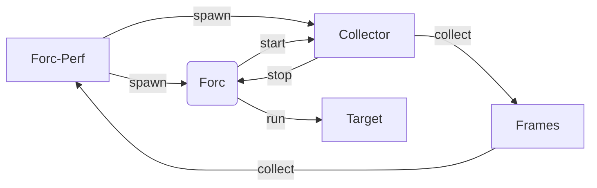

# Forc-Perf

## Description

This project is a profiler for the Sway compiler. It is designed to be lightweight and collect poison free data from the compiler.
It collects frames of data and timestamps for all the different compiler passes and the time it takes to run them. It also collects the time it takes to run the entire compilation.

## Design



The Forc-perf performs the following steps:

- Spawns the Forc compiler with the appropriate arguments.

- Spawns the collector.

- The compiler indicates to the collector that it is starting.

- The collector starts collecting data and timestamps for the compiler passes.

- The compiler indicates to the collector that it is stopping.

- The collector constructs the data to be returned to the Forc-perf.

## Data Structures

```rust
/// A collection of benchmarks and system specifications.
#[derive(Debug, Serialize)]
pub struct Benchmarks {
    pub system_specs: SystemSpecs,
    pub benchmarks: Vec<Benchmark>,
}

/// Benchmark metadata and phase-specific performance data.
#[derive(Clone, Debug, serde::Serialize)]
pub struct Benchmark {
    /// The name of the benchmark.
    pub name: String,
    /// The path to the benchmark's project folder.
    pub path: PathBuf,
    /// The start time of the benchmark.
    pub start_time: Option<SerdeInstant>,
    /// The end time of the benchmark.
    pub end_time: Option<SerdeInstant>,
    /// The phases of the benchmark.
    pub phases: Vec<BenchmarkPhase>,
    /// The performance frames collected from the benchmark.
    pub frames: SerdeFrames,
}

/// A named collection of performance frames representing a single phase of a benchmark.
#[derive(Clone, Debug, serde::Serialize)]
pub struct BenchmarkPhase {
    /// The name of the benchmark phase.
    pub name: String,
    /// The start time of the benchmark phase.
    pub start_time: Option<SerdeInstant>,
    /// The end time of the benchmark phase.
    pub end_time: Option<SerdeInstant>,
}

/// A single frame of performance information for a benchmark phase.
#[derive(Clone, Debug, serde::Serialize)]
pub struct BenchmarkFrame {
    /// The time that the frame was captured.
    pub timestamp: SerdeInstant,
    /// The process-specific CPU usage at the time the frame was captured.
    pub cpu_usage: f32,
    /// The total process-specific memory usage (in bytes) at the time the frame was captured.
    pub memory_usage: u64,
    /// The total process-specific virtual memory usage (in bytes) at the time the frame was captured.
    pub virtual_memory_usage: u64,
    /// The total number of bytes the process has written to disk at the time the frame was captured.
    pub disk_total_written_bytes: u64,
    /// The number of bytes the process has written to disk since the last refresh at the time the frame was captured.
    pub disk_written_bytes: u64,
    /// The total number of bytes the process has read from disk at the time the frame was captured.
    pub disk_total_read_bytes: u64,
    /// The number of bytes the process has read from disk since the last refresh at the time the frame was captured.
    pub disk_read_bytes: u64,
}

#[derive(Default, Debug, Clone, PartialEq, Serialize, Deserialize)]
pub struct SystemSpecs {
    #[serde(skip_serializing)]
    pub global_cpu_usage: f64,
    pub cpus: Vec<Cpu>,
    pub physical_core_count: i64,
    pub total_memory: i64,
    pub free_memory: i64,
    pub available_memory: i64,
    pub used_memory: i64,
    pub total_swap: i64,
    pub free_swap: i64,
    pub used_swap: i64,
    pub uptime: i64,
    pub boot_time: i64,
    pub load_average: LoadAverage,
    pub name: String,
    pub kernel_version: String,
    pub os_version: String,
    pub long_os_version: String,
    pub distribution_id: String,
    pub host_name: String,
}

#[derive(Default, Debug, Clone, PartialEq, Serialize, Deserialize)]
pub struct Cpu {
    #[serde(skip_serializing)]
    pub cpu_usage: f64,
    pub name: String,
    pub vendor_id: String,
    pub brand: String,
    pub frequency: i64,
}

#[derive(Default, Debug, Clone, PartialEq, Serialize, Deserialize)]
pub struct LoadAverage {
    pub one: f64,
    pub five: f64,
    pub fifteen: f64,
}
```
