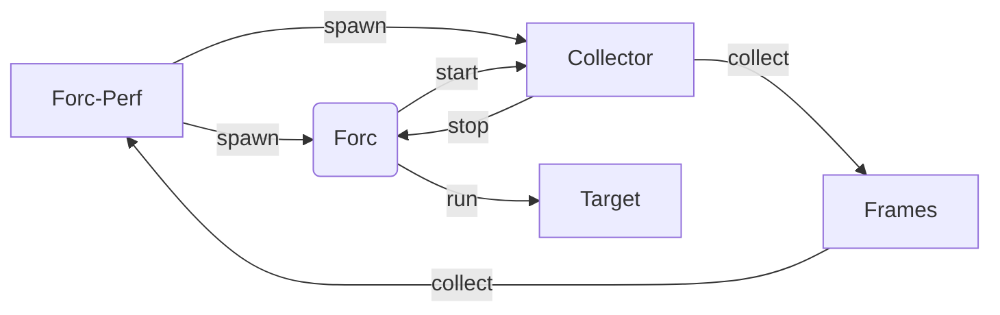

# Forc-Perf

## Description

This project is a profiler for the Sway compiler. It is designed to be lightweight and collect poison free data from the compiler.
It collects frames of data and timestamps for all the different compiler passes and the time it takes to run them. It also collects the time it takes to run the entire compilation.

## Design

The Forc-perf performs the following steps:

- Spawns the Forc compiler with the appropriate arguments.

- Spawns the collector.

- The compiler indicates to the collector that it is starting.

- The collector starts collecting data and timestamps for the compiler passes.

- The compiler indicates to the collector that it is stopping.

- The collector constructs the data to be returned to the Forc-perf.
